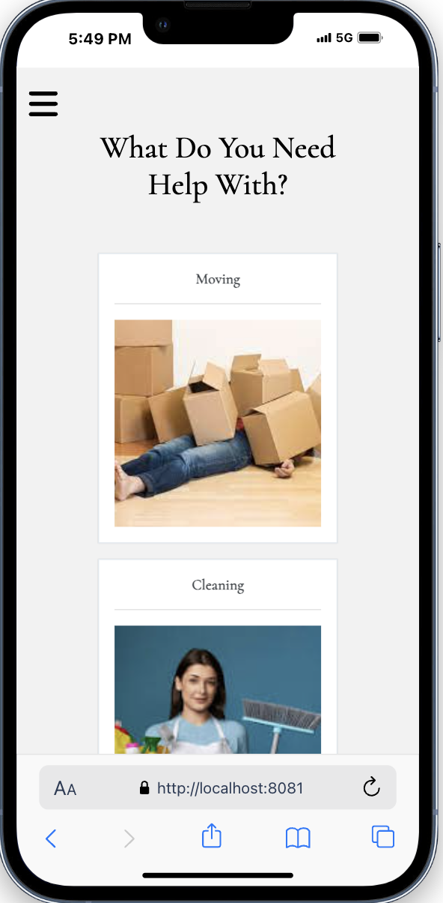
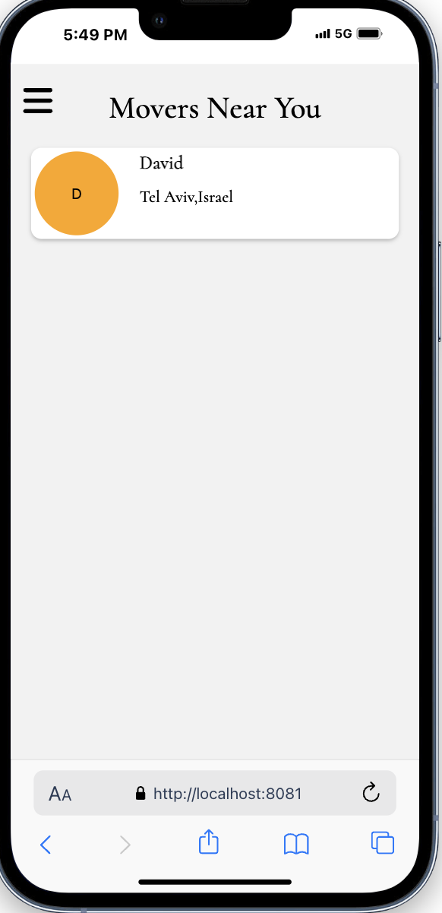
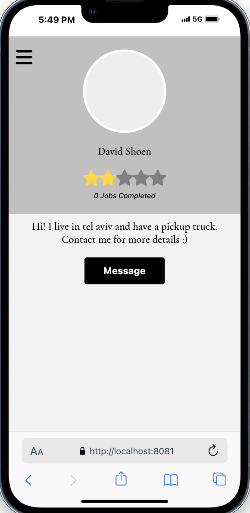
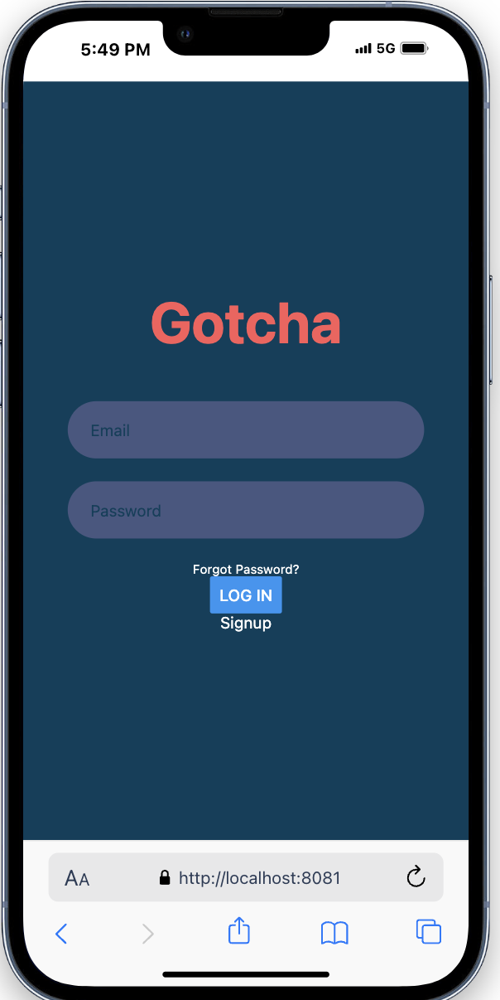
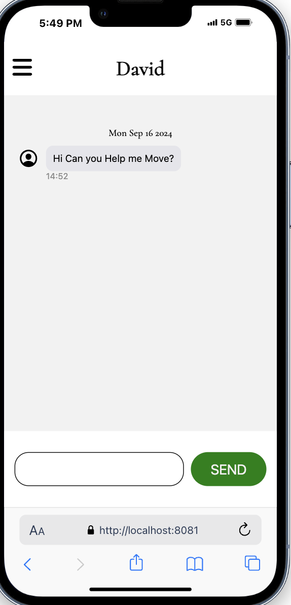

 ## Overview
 Gotcha is a fullstack application that allows users to find and chat with laborers to complete physically demanding tasks. Likewise it allows laborers to advertise
 their services and chat with potential customers.

The frontend is written in React and the backend in node.js.

 ## Starting the Application
 To start the application, navigate into each folder and run __npm start__ respectively. Ensure that all packages are installed by running __npm install__

 ## Snapshots
 
 
Lets see what a user may experience navigating the app to find a mover to help he/she move
  
 
 __Homepage__ - The user is prompted to select the type of task he/she need help with
  
  
 
  
  
  __Movers__ - A list of movers in the area are presented
  
  
 
  
  
  __Choosing a Mover__ - After clicking on a mover, the user sees the mover's rating, picture (coming soon),  short blurb about him/herself, and chat button
  
  
  
  
  
   __Sign In__ - If the user wishes to chat with a mover, but the user is not logged in, the user is prompted to login
  
  
  
  
  
  __Chatting with a Mover__ - The user is able to send the mover messages
  
  
 

 ## What's coming
 This application is unfinished and is still being developed. Features to be added: 
 (1) Laborer signup  
 (2) Message home (area where a user/laborer can view all of their messages) 
 (3) Pictures  
 (4) Task completion - upon a tasks completion, a user labrorer will be asked to review each other  
 (5) Replace signin/signup with google credentials  
 (6) Location preferences  
 

 
 
